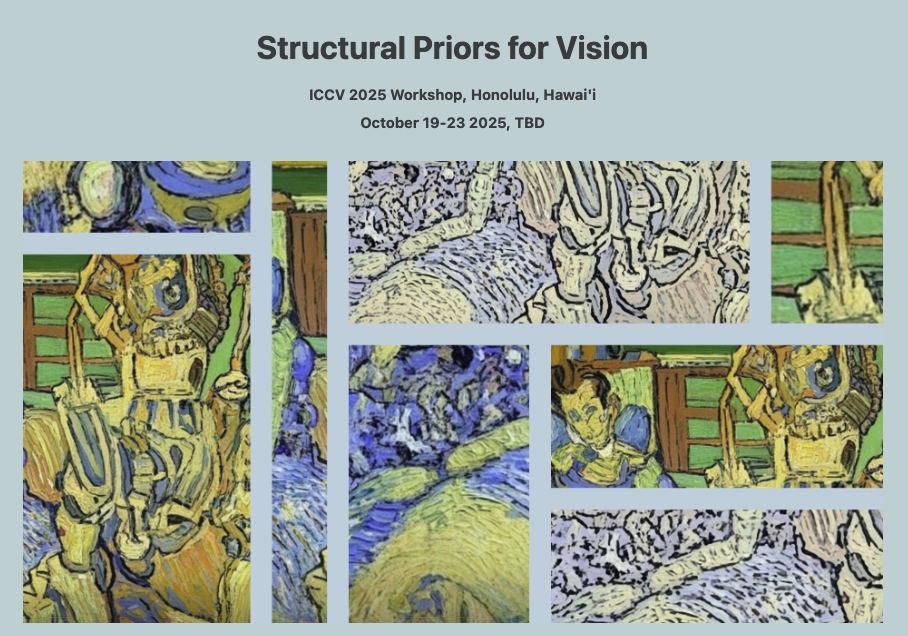

  

## Authors and origin

  <table>
    <tr>
      <td align="center" style="border: none;">
        <a href="https://github.com/simoncoessens">
          
          
<b>Simon Coessens</b>

        </a>
        
CentraleSupélec • Paris, France

      </td>
      <td align="center" style="border: none; padding-left: 24px;">
        <a href="https://github.com/1-ARIjitS">
          
          
<b>Arijit Samal</b>

        </a>
        
CentraleSupélec • Paris, France

      </td>
    </tr>
  </table>

  Supervised by
   
  
  
<a href="https://github.com/akashjorss"><b>Akash Malhotra</b></a>

This project was initiated during our Master’s at CentraleSupélec, and we have continued (and are still continuing) to develop it as a side project.

### Abstract

Diffusion models have become a leading approach in generative image modeling, but many still operate in dense pixel space, a representation that is computationally intensive and lacks geometric structure. We propose Gaussian-Diffusion, a framework that performs the denoising process entirely in a latent space composed of 2D Gaussians. Each image is encoded as a set of 150 anisotropic Gaussian splats, parameterized by position, covariance, and color. To model their dynamics, we introduce GaussianTransformer, a permutation-equivariant transformer that serves as the denoising network. Evaluated on MNIST and Sprites datasets, our method achieves visual quality comparable to a pixel space U-Net baseline, while reducing the number of sampling steps from 1000 to 200 and the per-step cost from 11.4 GFLOPs to 4 GFLOPs, resulting in an overall 22× improvement in generation time on an A100 GPU. In contrast to latent diffusion models, our approach does not require an auxiliary autoencoder and preserves full editability of the latent. These findings suggest that structured geometric representations can offer efficient and interpretable alternatives to latent and pixel-based diffusion.

## Current status

GaussianDiffusion is an ongoing research effort. Early evidence suggests that learning in a structured Gaussian latent delivers competitive visual quality with significantly fewer sampling steps and lower compute. We are actively expanding experiments and ablations across datasets and architectural choices, and have submitted to the ICCV 2025 Structural Priors for Vision (SP4V) workshop to gather feedback and iterate; see the reviews and workshop link below. We have intentionally not included quantitative evaluations yet, as we are prioritizing core improvements; we will release comprehensive metrics (e.g., FID/IS/KID) as we finalize the model.

- Paper (preprint): <a href="GaussianDiffusion__Learning_Image_Generation_Process_in_GaussianRepresentation_Space.pdf">GaussianDiffusion — Learning Image Generation Process in Gaussian Representation Space </a>
- Review PDF (SP4V workshop): <a href="ICCV_SP4V_REVIEWS.pdf">ICCV Structural Priors for Vision (SP4V) reviews </a>
- SP4V workshop website: [sp4v.github.io](https://sp4v.github.io/)

## Highlights

- **Gaussian latent space**: Represent each image as a set of K Gaussians with per-point parameters (e.g., σx, σy, ρ, RGB/alpha, x, y)
- **Diffusion over sets**: Transformer-based noise predictor with timestep conditioning (DDPM-style schedule)
- **Differentiable rendering**: Reconstruct images from Gaussians via splatting
- **Datasets**: MNIST (K=70, 7-dim), Sprites (K≈150–500, 8–9 dim), CIFAR-10 (K=200, 8-dim)
- **Metrics**: FID, Inception Score, KID

## Animations

  <table>
    <tr>
      <th>MNIST — Forward (Gaussian latent)</th>
      <th>MNIST — Forward (Pixel space)</th>
    </tr>
    <tr>
      <td></td>
      <td></td>
    </tr>
    <tr>
      <th>Sprites — Forward (Gaussian latent)</th>
      <th>Sprites — Forward (Pixel space)</th>
    </tr>
    <tr>
      <td></td>
      <td></td>
    </tr>
    <tr>
      <th>MNIST — Sampling (Gaussian latent)</th>
      <th>MNIST — Sampling (Pixel space)</th>
    </tr>
    <tr>
      <td></td>
      <td></td>
    </tr>
    <tr>
      <th>Sprites — Sampling (Gaussian latent)</th>
      <th></th>
    </tr>
    <tr>
      <td colspan="2" align="center"></td>
    </tr>
  </table>

## Data

This project uses precomputed Gaussian representations:

- **MNIST**: directory `mnist_gaussian_representations/`, each file contains `W` with shape `[70, 7]`.
- **Sprites (32×32 / 64×64)**: HDF5 under `W/sprite_*` with `scaling, rotation, opacity, features, xyz`.
- **CIFAR-10**: HDF5 under `W/img_*` with the same per-parameter datasets.

See loaders in `src/dataset.py` for exact formats.

## Repository structure

- `src/models/` — Transformer architectures (e.g., `transformer_model.py`, `flash_transformer_model.py`)
- `src/train/` — Training scripts for MNIST, Sprites, CIFAR-10
- `src/metrics/` — Sampling and evaluation utilities (FID/IS/KID)
- `src/utils/` — Normalization/denormalization and rendering helpers
- `src/ddpm.py` — DDPM schedules (linear/cosine)
- `src/dataset.py` — Dataset readers for Gaussian latents
- `Preliminary work/` — Notebooks and dataset preparation drafts

## Useful references

- Model API: `src/models/transformer_model.py`
- Schedules: `src/ddpm.py`
- Rendering: `src/utils/gaussian_to_image.py`

## Reproduction Guide

- Ensure your dataset paths are correct and match the expected structure (`src/dataset.py`).
- For module imports to work consistently, prefer `python -m src.<...>` from the repo root, or set `PYTHONPATH=$(pwd)`.
- Some scripts contain HPC paths; replace with your local absolute paths.

## Citation

If you use this code, please cite the accompanying preprint in this repository. You can also reference this repository directly.

## License

If you plan to open-source beyond this challenge, add your license of choice (e.g., MIT/Apache-2.0). For review, all code is provided as-is for research.
