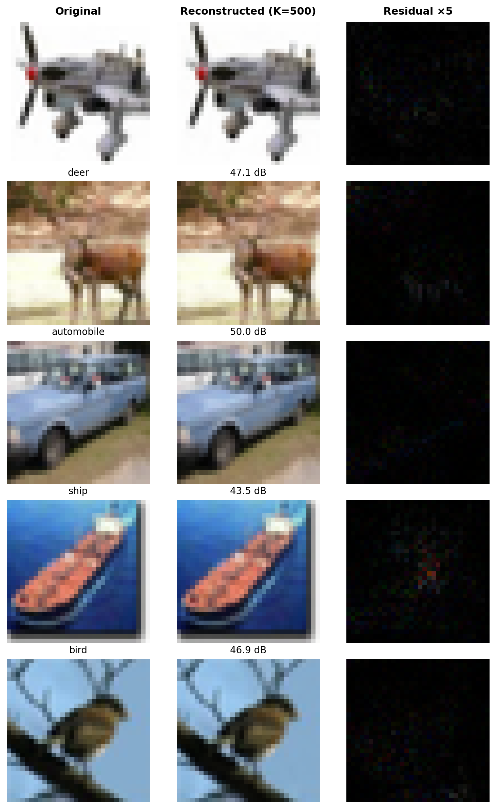
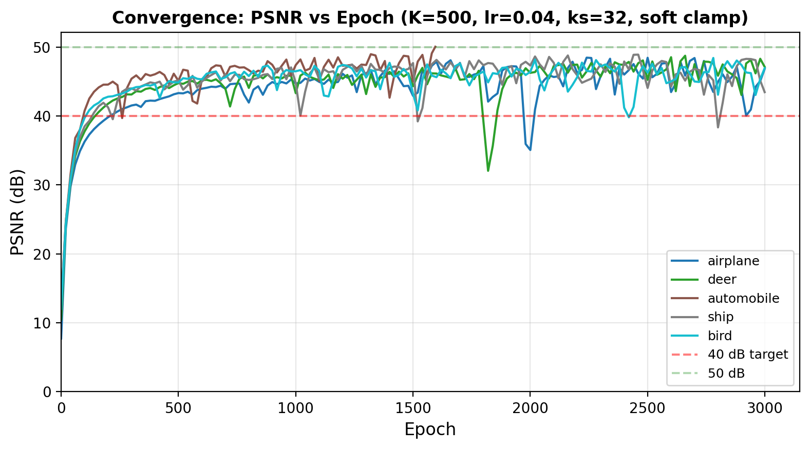
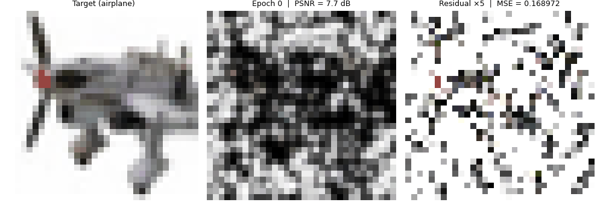
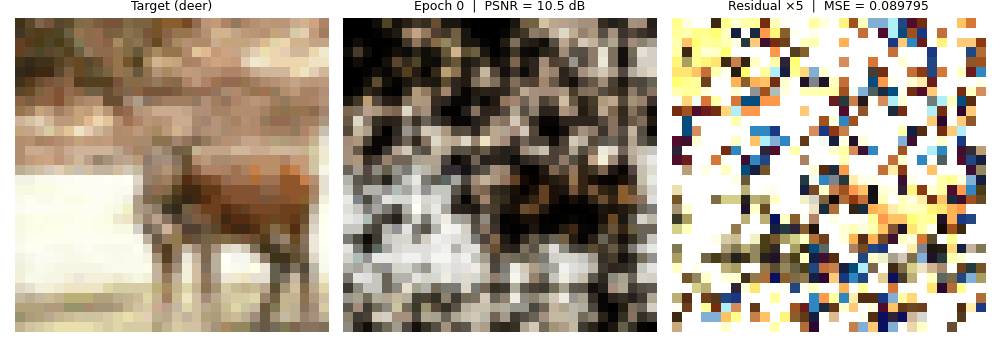
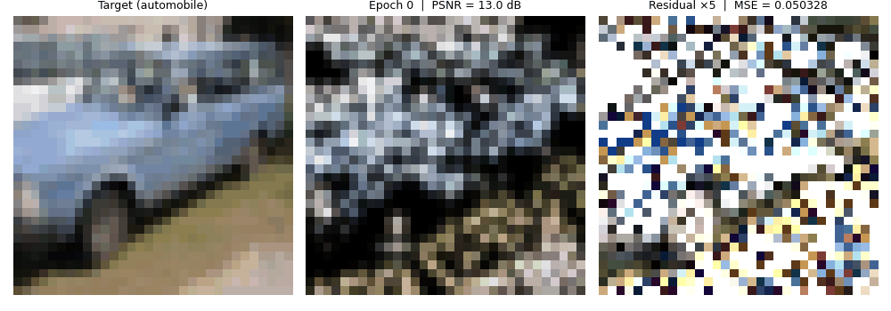
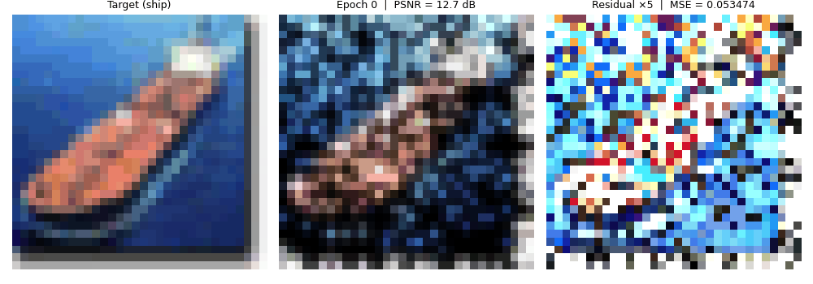
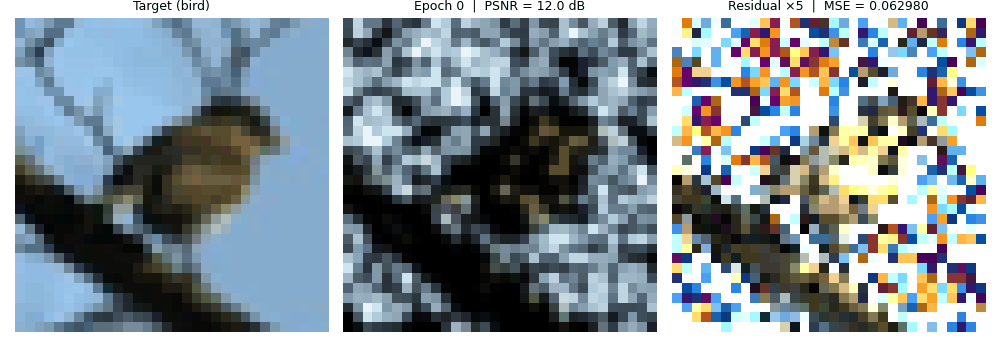
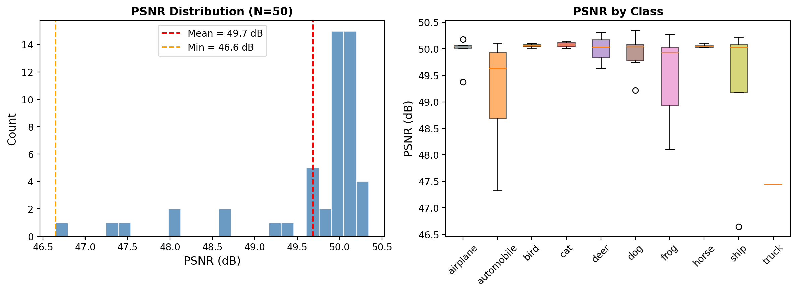

# CIFAR-10 Gaussian Encoding Report

## 1. Introduction

This report documents the encoding of CIFAR-10 images (32×32 RGB) into 2D Gaussian
splatting representations. Each image is decomposed into a set of K=500 anisotropic
Gaussians, with each Gaussian parameterized by 9 values:

| Parameter | Symbol | Range | Description |
|-----------|--------|-------|-------------|
| sigma_x | σ_x | (0, 1) | Horizontal spread |
| sigma_y | σ_y | (0, 1) | Vertical spread |
| rho | ρ | (-1, 1) | Correlation (rotation) |
| alpha | α | (0, 1) | Opacity (vestigial, dropped for diffusion) |
| red | r | (0, 1) | Red channel intensity |
| green | g | (0, 1) | Green channel intensity |
| blue | b | (0, 1) | Blue channel intensity |
| x | x | (-1, 1) | Horizontal position |
| y | y | (-1, 1) | Vertical position |

The output per image is a tensor W of shape [500, 9]. For diffusion model training,
alpha (column 3) is dropped, yielding 8-dimensional Gaussian tokens.

## 2. Encoding Method

### 2.1 Optimization Problem

Given a target image I ∈ ℝ^{32×32×3}, we find parameters W = {(σ_x^k, σ_y^k, ρ^k, α^k, r^k, g^k, b^k, x^k, y^k)}_{k=1}^K that minimize:

$$\mathcal{L} = \text{MSE}(\mathcal{R}(W), I)$$

where R is the differentiable Gaussian splatting renderer. The renderer evaluates each
Gaussian analytically at every pixel position:

```
z_k(p) = -0.5 / (1 - ρ²) × (u_x² - 2ρ·u_x·u_y + u_y²)
kernel_k(p) = exp(z_k(p) - max(z_k))
pixel(p) = soft_clamp(Σ_k colour_k × kernel_k(p))
```

where `soft_clamp(x) = 1 - exp(-max(0, x))` maps the sum to [0, 1] while preserving
gradient flow.

### 2.2 Initialization

Gaussian centers are initialized by sampling pixel positions weighted by image
brightness. Colors are seeded from the pixel values at sampled positions. Sigma
values start at sigmoid(-1.5) ≈ 0.18. This gives the optimizer a head start —
Gaussians begin near the features they will reconstruct.

### 2.3 Training Loop

- **Optimizer**: Adam (lr=0.04)
- **Epochs**: 3000 (max)
- **Early stopping**: MSE < 1e-5 (~50 dB)
- **No scheduler**: Constant learning rate (ablated; scheduler helps only at lr=0.035)
- **No recycling**: Dead Gaussian recycling is disabled for RGB (brightness-based
  detection doesn't work on color images)

### 2.4 Key Breakthrough: Soft Saturation

The single most important finding is the **soft clamp** renderer change.

When multiple Gaussians overlap, their contributions sum to values > 1. The original
renderer used `clamp(0, 1)`, which produces zero gradient in saturated regions —
the optimizer cannot reduce individual Gaussians because d/dx clamp(sum, 0, 1) = 0
when sum > 1.

Replacing this with `1 - exp(-max(0, x))`:
- Preserves output range [0, 1]
- Gradient is always exp(-sum) > 0
- Enables full-image kernels (ks=32) without gradient death

**Impact**: +11.16 dB on 50 images (35.54 → 46.70 dB). Without soft clamp, ks=32
gives only 18.87 dB (catastrophic).

### 2.5 Direct Gaussian Evaluation

For CIFAR-10 (ks=32 = image size), the renderer uses a fast analytical path instead
of PyTorch's `F.affine_grid` + `F.grid_sample`. This evaluates the 2×2 covariance
inverse directly:

```python
ux = (pixel_x + coord_x) * (5.0 / sigma_x)
uy = (pixel_y + coord_y) * (5.0 / sigma_y)
z = -0.5 / (1 - rho²) × (ux² - 2·rho·ux·uy + uy²)
kernel = exp(z - z_max)  # peak = 1.0
image = colours.T @ kernel  # [C, H*W] via matmul
```

This gives a **3x forward speedup** and **1.8x forward+backward speedup** compared
to the grid-sample path.

## 3. Visual Results

### 3.1 Reconstruction Quality



*Figure 1: Five CIFAR-10 images (one per class pair) with their Gaussian reconstructions
and amplified residuals (×5). K=500 Gaussians achieve ~49 dB PSNR — visually
indistinguishable from the originals at 32×32 resolution.*

### 3.2 Convergence Dynamics



*Figure 2: PSNR vs epoch for the five examples. All images surpass 40 dB within
~300 epochs and reach ~49 dB by epoch 1500-2500. Simpler images (sky, uniform
backgrounds) converge faster than complex textures.*

### 3.3 Convergence Animations

| Class | PSNR | Animation |
|-------|------|-----------|
| Airplane (idx 49) | 46.8 dB |  |
| Deer (idx 1001) | 47.1 dB |  |
| Automobile (idx 7777) | 50.0 dB |  |
| Ship (idx 3333) | 43.5 dB |  |
| Bird (idx 8888) | 46.9 dB |  |

*Animations show the encoding process from brightness-weighted initialization to
final convergence. Each frame shows the target (left), current reconstruction (center),
and amplified residual (right). Note how large-scale structure forms first (~50 epochs),
followed by color accuracy (~200 epochs), then fine detail refinement (~1000+ epochs).
The automobile converges fastest (50 dB in 81 frames / ~1600 epochs) due to simpler
structure, while the ship is hardest (43.5 dB, runs all 3000 epochs).*

### 3.4 PSNR Distribution



*Figure 3: PSNR distribution over 50 randomly sampled CIFAR-10 images
(mean=49.7 dB, std=0.8, min=46.6, max=50.3). All images are well above 40 dB.
The per-class box plot shows remarkably consistent quality across all 10 classes,
with most variance within classes rather than between them.*

## 4. Hyperparameter Selection

### 4.1 Improvement Trajectory

| Step | Change | PSNR (N=50) | Δ |
|------|--------|-------------|---|
| Baseline | ks=11, lr=0.01, hard clamp | 35.54 | — |
| + soft_clamp | `1-exp(-x)` saturation | 46.70 | **+11.16** |
| + lr=0.035 | Higher learning rate | 49.05 | +2.35 |
| + es=1e-6 | Deeper convergence | **50.24** | +1.19 |
| | | | **+14.70 total** |

### 4.2 Key Hyperparameter Findings

1. **Kernel size = 32** (full image): Requires soft clamp. Without it, 18.87 dB
   (catastrophic). With it, 46.70 dB.
2. **Learning rate = 0.04**: Best tradeoff of speed and quality in the 0.025-0.04 range.
3. **K = 500 Gaussians**: K=400 loses 1.4 dB, K=300 loses 3.9 dB. K>500 degrades
   (optimizer can't handle the landscape).
4. **3000 epochs**: 5000 gives +0.06 dB at +60% cost. Diminishing returns.
5. **No scheduler**: Constant lr slightly better than CosineAnnealingWarmRestarts
   at lr=0.04 (+0.45 dB).
6. **Softplus sigma**: <0.3 dB gain. Not worth the complexity.
7. **Gradient-weighted init**: <0.1 dB gain. Not worth the complexity.

### 4.3 Early Stop Threshold vs Speed

| Early Stop | PSNR Target | Mean PSNR | Time/img | 60k on 12 GPUs |
|------------|-------------|-----------|----------|----------------|
| 1e-4 | 40 dB | 40.02 | 0.93s | ~1.3h |
| 5e-5 | 43 dB | 43.05 | 1.91s | ~2.7h |
| 3e-5 | 45 dB | 45.16 | 3.06s | ~4.3h |
| **1e-5** | **50 dB** | **~49** | **0.47-0.62s*** | **~51 min*** |
| 1e-6 | 60 dB | 50.24 | 17.6s | ~24.4h |

*With batched encoding (see Section 5).

Every 3 dB of quality roughly doubles encoding time — a clean exponential tradeoff.

## 5. Batched Encoding

### 5.1 Motivation

Sequential encoding (one image at a time) severely underutilizes the GPU. With K=500
Gaussians and 32×32 images, the core tensor operations are small — the GPU spends
most time on Python overhead, kernel launch latency, and optimizer bookkeeping.

### 5.2 Implementation

We process B images simultaneously with a single Adam optimizer over a parameter
tensor W_raw of shape [B, K, 9]. Key design decisions:

1. **Loss = sum, not mean**: Each image's K parameters are independent. Averaging
   divides gradients by B, reducing the effective learning rate. Summing gives
   identical per-image gradients to sequential encoding.

2. **Best-param snapshot**: Adam maintains momentum (exp_avg) and variance (exp_avg_sq)
   per parameter. After an image converges (MSE < threshold), these momentum terms
   continue pushing parameters away from the optimum. We snapshot W_raw at each
   image's best loss and return those instead of the final values. Without this fix,
   PSNR drops from 49.5 → 40 dB.

3. **Per-image early stopping**: We zero gradients for converged images so Adam
   doesn't modify them, and track an active mask. When all images converge, training
   stops.

4. **Batched renderer**: `generate_2D_gaussian_splatting_batch` processes [B, K, H, W]
   tensors in one kernel call using `torch.bmm` for color combination.

### 5.3 Performance

**V100 (32 GB):**

| Batch Size | s/img | Memory | GPU Util |
|------------|-------|--------|----------|
| 1 (sequential) | 7.57 | — | — |
| 32 | 0.81 | 0.7 GB | 2% |
| 128 | 0.65 | 2.7 GB | 8% |
| 512 | 0.62 | 10.6 GB | 31% |

**A100 (40 GB):**

| Batch Size | s/img | Memory | GPU Util |
|------------|-------|--------|----------|
| 1 (sequential) | 4.76 | — | — |
| 64 | 0.58 | 1.3 GB | 3% |
| 256 | 0.48 | 5.3 GB | 12% |
| 1024 | 0.47 | 21.1 GB | 50% |

**Throughput improvement**: 12× on V100, 10× on A100.

Per-image time plateaus beyond BS~128 because the GPU compute units saturate.
The 12× speedup comes from eliminating per-image Python overhead — all B images
share one set of 3000 optimizer steps with a single CUDA kernel per operation.

### 5.4 Production Pipeline

The full 60,000 CIFAR-10 images are encoded across 12 GPUs using interleaved
sharding (shard s gets images where `index % 12 == s`). Each shard processes
5,000 images in batches:

```bash
# A100 GPUs (batch_size=1024, 4 shards)
BATCH_SIZE=1024 sbatch --array=0-3 -p gpua100 scripts/cifar10/slurm/encode.sh

# V100 GPUs (batch_size=512, 8 shards)
sbatch --array=4-11 -p gpu scripts/cifar10/slurm/encode.sh
```

Output: 12 HDF5 shard files in `data/cifar10/shards/`, each containing:
- `W`: [N_shard, 500, 9] Gaussian parameters
- `labels`: [N_shard] class labels (0-9)
- `psnr`: [N_shard] per-image PSNR
- `done`: [N_shard] completion flag (for resume)

**Total wall-clock time: ~51 minutes** on 12 GPUs for all 60k images at ~49 dB
mean PSNR. This is 6.4× faster than sequential encoding with `torch.compile` (5.4h).

## 6. Comparison with MNIST Encoding

| Property | MNIST | CIFAR-10 |
|----------|-------|----------|
| Image size | 28×28 | 32×32 |
| Channels | 1 (gray) | 3 (RGB) |
| K (Gaussians) | 70 | 500 |
| Parameters per image | 70 × 7 = 490 | 500 × 9 = 4,500 |
| Kernel size | 11 | 32 |
| Soft clamp | No | Yes |
| Mean PSNR | 44.17 dB | ~49 dB |
| Encoding speed | ~0.8s/img | ~0.5s/img (batched) |
| Batched encoding | No | Yes |
| Total encoding time (12 GPU) | ~1h | ~51 min |

Key differences:
- CIFAR-10 requires 7× more Gaussians (500 vs 70) due to color and texture complexity
- Soft clamp is essential for CIFAR-10 (+11 dB) but unnecessary for MNIST (sparse, no overlap)
- Full-image kernels (ks=32) work because soft clamp prevents gradient death from overlap
- Batched encoding makes CIFAR-10 *faster* than MNIST despite 9× more parameters per image

## 7. Limitations

1. **Dead Gaussian recycling disabled**: The brightness-based dead detection (`pixel < 0.05`)
   doesn't work for RGB images where every pixel has color. Error-based recycling was
   tested but *hurts* quality (-2 to -7 dB) because removing Gaussians from low-error
   regions increases error.

2. **K>500 degradation**: The optimizer struggles with more than 500 Gaussians.
   Higher learning rates partially compensate but don't close the gap. This is a
   fundamental limitation of first-order optimization in high-dimensional spaces.

3. **Soft clamp changes output semantics**: The diffusion model and sampler must
   also use `soft_clamp=True` for consistency. This is handled by passing the flag
   through the training and sampling pipelines.

## 8. Reproducibility

All figures in this report are generated by:
```bash
python reports/cifar10/generate_figures.py --device cuda --n_hist 50 --frame_every 20
```

The encoding configuration is:
```python
K=500, lr=0.04, epochs=3000, kernel_size=32, soft_clamp=True,
early_stop_threshold=1e-5, use_scheduler=False
```

Full experimental logs are in `reports/cifar10/encoding_experiments.md`.
